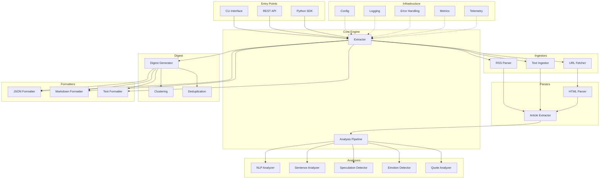
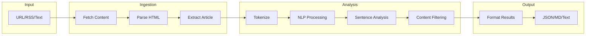
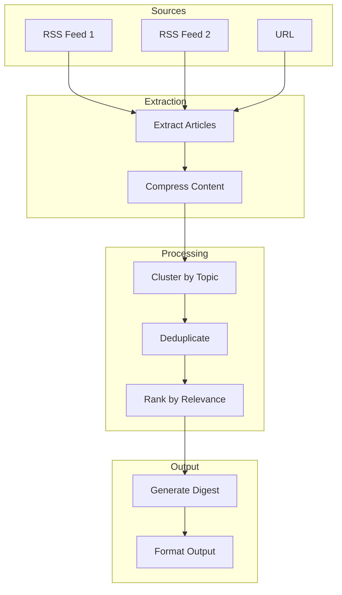
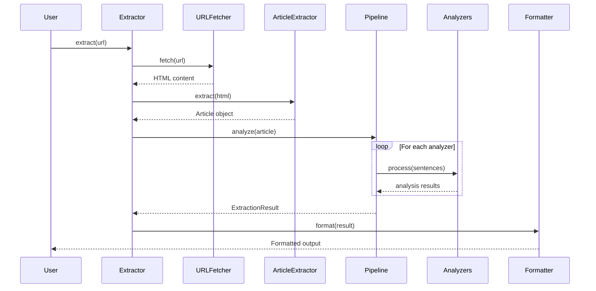
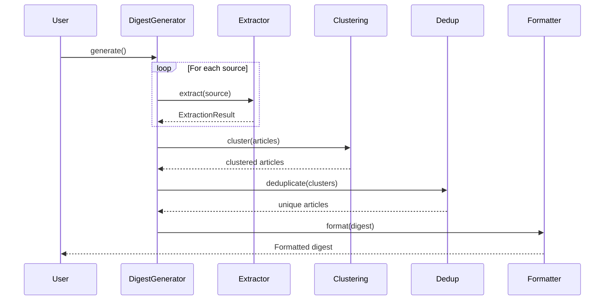
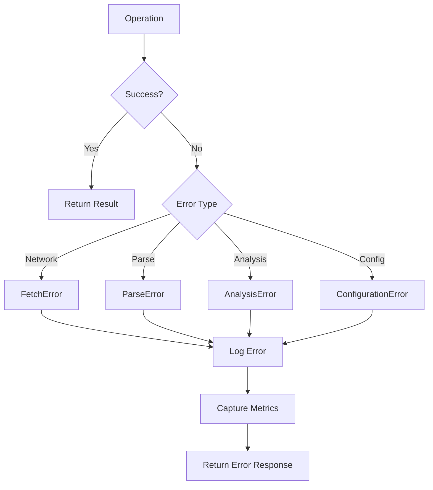

# NewsDigest Architecture

This document describes the system architecture, component interactions, and data flow of NewsDigest.

## System Overview

NewsDigest is a semantic compression engine that transforms news content into concise, factual summaries by removing speculation, emotional language, and redundant content.

```
┌─────────────────────────────────────────────────────────────────────────────┐
│                              NewsDigest System                               │
├─────────────────────────────────────────────────────────────────────────────┤
│                                                                             │
│  ┌─────────────┐    ┌─────────────┐    ┌─────────────┐    ┌─────────────┐  │
│  │   CLI/API   │───▶│  Ingestors  │───▶│   Parsers   │───▶│  Analyzers  │  │
│  └─────────────┘    └─────────────┘    └─────────────┘    └─────────────┘  │
│         │                                                        │          │
│         │                                                        ▼          │
│         │          ┌─────────────┐    ┌─────────────┐    ┌─────────────┐   │
│         └─────────▶│  Formatters │◀───│    Core     │◀───│   Digest    │   │
│                    └─────────────┘    └─────────────┘    └─────────────┘   │
│                          │                   │                              │
│                          ▼                   ▼                              │
│                    ┌─────────────┐    ┌─────────────┐                      │
│                    │   Output    │    │   Storage   │                      │
│                    └─────────────┘    └─────────────┘                      │
│                                                                             │
└─────────────────────────────────────────────────────────────────────────────┘
```

## Component Architecture



## Data Flow Diagram



## Detailed Data Flow

```
┌──────────────────────────────────────────────────────────────────────────────┐
│                           EXTRACTION DATA FLOW                                │
├──────────────────────────────────────────────────────────────────────────────┤
│                                                                              │
│  ┌────────┐     ┌─────────┐     ┌─────────┐     ┌──────────┐                │
│  │ Source │────▶│ Ingest  │────▶│  Parse  │────▶│ Tokenize │                │
│  │URL/RSS │     │ Content │     │  HTML   │     │   Text   │                │
│  └────────┘     └─────────┘     └─────────┘     └──────────┘                │
│                                                       │                      │
│                                                       ▼                      │
│  ┌────────────────────────────────────────────────────────────────────────┐ │
│  │                        ANALYSIS PIPELINE                                │ │
│  ├────────────────────────────────────────────────────────────────────────┤ │
│  │                                                                        │ │
│  │  ┌─────────────┐  ┌─────────────┐  ┌─────────────┐  ┌─────────────┐   │ │
│  │  │    NLP      │  │  Sentence   │  │ Speculation │  │  Emotional  │   │ │
│  │  │  Analysis   │──│  Density    │──│  Detection  │──│  Language   │   │ │
│  │  │ (spaCy)     │  │   Score     │  │             │  │  Detection  │   │ │
│  │  └─────────────┘  └─────────────┘  └─────────────┘  └─────────────┘   │ │
│  │         │                                                  │           │ │
│  │         ▼                                                  ▼           │ │
│  │  ┌─────────────┐                                   ┌─────────────┐    │ │
│  │  │   Quote     │                                   │   Hedge     │    │ │
│  │  │  Analysis   │                                   │  Detection  │    │ │
│  │  └─────────────┘                                   └─────────────┘    │ │
│  │                                                                        │ │
│  └────────────────────────────────────────────────────────────────────────┘ │
│                                       │                                      │
│                                       ▼                                      │
│  ┌─────────────┐     ┌─────────────┐     ┌─────────────┐                    │
│  │   Filter    │────▶│  Compress   │────▶│   Format    │                    │
│  │  Content    │     │   Output    │     │   Result    │                    │
│  └─────────────┘     └─────────────┘     └─────────────┘                    │
│                                                 │                            │
│                                                 ▼                            │
│                                          ┌───────────┐                       │
│                                          │  Output   │                       │
│                                          │JSON/MD/TXT│                       │
│                                          └───────────┘                       │
│                                                                              │
└──────────────────────────────────────────────────────────────────────────────┘
```

## Digest Generation Flow



## Module Dependencies

```
newsdigest/
├── __init__.py          # Package exports
├── version.py           # Version info
├── exceptions.py        # Custom exceptions
│
├── config/              # Configuration management
│   └── settings.py      # Config dataclasses
│
├── core/                # Core extraction engine
│   ├── extractor.py     # Main Extractor class
│   ├── pipeline.py      # Analysis pipeline
│   ├── article.py       # Article model
│   └── result.py        # Result models
│
├── ingestors/           # Content ingestion
│   ├── url.py           # URL fetcher
│   ├── rss.py           # RSS parser
│   └── text.py          # Text ingestor
│
├── parsers/             # Content parsing
│   └── article.py       # HTML/article extraction
│
├── analyzers/           # Content analysis
│   ├── nlp.py           # NLP processing
│   ├── sentence.py      # Sentence analysis
│   ├── speculation.py   # Speculation detection
│   ├── emotion.py       # Emotion detection
│   └── quotes.py        # Quote analysis
│
├── digest/              # Digest generation
│   ├── generator.py     # Digest generator
│   ├── clustering.py    # Topic clustering
│   └── dedup.py         # Deduplication
│
├── formatters/          # Output formatting
│   ├── json.py          # JSON formatter
│   ├── markdown.py      # Markdown formatter
│   └── text.py          # Plain text formatter
│
├── utils/               # Utilities
│   ├── http.py          # HTTP client
│   ├── logging.py       # Logging setup
│   ├── errors.py        # Error handling
│   ├── metrics.py       # Metrics collection
│   ├── telemetry.py     # Telemetry
│   ├── text.py          # Text utilities
│   └── validation.py    # Input validation
│
├── cli/                 # Command-line interface
│   └── main.py          # CLI entry point
│
├── api/                 # REST API
│   └── routes/          # API route handlers
│
└── storage/             # Data persistence
    └── cache.py         # Caching layer
```

## Sequence Diagram: Single Article Extraction



## Sequence Diagram: Digest Generation



## Deployment Architecture

```
┌─────────────────────────────────────────────────────────────────────────────┐
│                          DEPLOYMENT OPTIONS                                  │
├─────────────────────────────────────────────────────────────────────────────┤
│                                                                             │
│  ┌─────────────────────────────────────────────────────────────────────┐   │
│  │                      Option 1: Python Package                        │   │
│  │  ┌─────────┐                                                        │   │
│  │  │  pip    │──▶ newsdigest (from PyPI or local)                     │   │
│  │  │ install │                                                        │   │
│  │  └─────────┘                                                        │   │
│  └─────────────────────────────────────────────────────────────────────┘   │
│                                                                             │
│  ┌─────────────────────────────────────────────────────────────────────┐   │
│  │                      Option 2: Docker Container                      │   │
│  │  ┌─────────────┐    ┌─────────────┐    ┌─────────────┐              │   │
│  │  │   Docker    │───▶│  NewsDigest │───▶│  REST API   │              │   │
│  │  │   Image     │    │  Container  │    │  :8080      │              │   │
│  │  └─────────────┘    └─────────────┘    └─────────────┘              │   │
│  └─────────────────────────────────────────────────────────────────────┘   │
│                                                                             │
│  ┌─────────────────────────────────────────────────────────────────────┐   │
│  │                      Option 3: Standalone Binary                     │   │
│  │  ┌─────────────┐                                                    │   │
│  │  │ PyInstaller │──▶ newsdigest executable (Linux/Mac/Windows)       │   │
│  │  │   Binary    │                                                    │   │
│  │  └─────────────┘                                                    │   │
│  └─────────────────────────────────────────────────────────────────────┘   │
│                                                                             │
└─────────────────────────────────────────────────────────────────────────────┘
```

## Error Handling Flow



## Configuration Hierarchy

```
┌─────────────────────────────────────────────────────────────────┐
│                    Configuration Sources                         │
├─────────────────────────────────────────────────────────────────┤
│                                                                 │
│  Priority (highest to lowest):                                  │
│                                                                 │
│  1. ┌─────────────────┐                                        │
│     │ Runtime Args    │  CLI flags, API parameters              │
│     └────────┬────────┘                                        │
│              ▼                                                  │
│  2. ┌─────────────────┐                                        │
│     │ Environment     │  NEWSDIGEST_* variables                 │
│     │ Variables       │                                        │
│     └────────┬────────┘                                        │
│              ▼                                                  │
│  3. ┌─────────────────┐                                        │
│     │ Config File     │  config/*.yaml                          │
│     └────────┬────────┘                                        │
│              ▼                                                  │
│  4. ┌─────────────────┐                                        │
│     │ Defaults        │  Built-in defaults                      │
│     └─────────────────┘                                        │
│                                                                 │
└─────────────────────────────────────────────────────────────────┘
```

## Technology Stack

| Layer | Technology |
|-------|------------|
| Language | Python 3.11+ |
| NLP | spaCy |
| HTTP Client | httpx (async) |
| HTML Parsing | BeautifulSoup4, lxml |
| Article Extraction | readability-lxml |
| RSS Parsing | feedparser |
| Configuration | Pydantic, python-dotenv |
| CLI | Click, Rich |
| API Framework | FastAPI (planned) |
| Testing | pytest, pytest-asyncio |
| Type Checking | mypy |
| Linting | ruff |
| Documentation | MkDocs |
